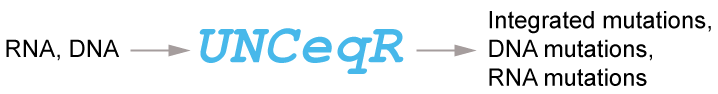
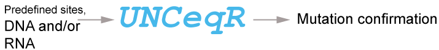

|*UNCeqR*|
|------|

####Author: Matthew D. Wilkerson
Copyright: Matthew D. Wilkerson, 2011-2015.
mdwilkerson@outlook.com
  
##Introduction
Precision cancer medicine depends on accurate somatic mutation detection to inform patient treatment, which is complicated by low tumor purity. 
In this setting, standard techniques using DNA whole exome sequencing yield low sensitivity. 
*UNCeqR* is a first-of-its-kind method that integrates patient-matched DNA sequencing and RNA sequencing to detect somatic mutations. 
In a published study, UNCeqR has been shown to substantially boosts sensitivity for low purity tumors as well as advancing state-of-the-art 
mutation profiles with abundant novel driver and therapeutically-targeted mutation discoveries. 
  
UNCeqR is versatile.  There are different modes of operation, depending on input and options, including:
 

 

 

 
  

#####Configuring and tuning UNCeqR for different cohorts or sequencing types is important to achieve high performance.  This is set through the set of options and library files described below.  It is hard-coded for human mutation calling, but this can easily be adjusted for other organisms. For configuration and tuning questions, collaborations or consulting, email mdwilkerson@outlook.com.

 
 
##Citation
Please cite this reference in publications or presentations using UNCeqR or UNCeqR results:
  
[1] 
Wilkerson MD, Cabanski CR, Sun W, Hoadley KA, Walter V, Mose LE, Troester MA, Hammerman PS, Parker JS, Perou CM, Hayes DN. (2014) Integrated RNA and DNA sequencing improves mutation detection in low purity tumors Nucleic Acids Research. first published online June 26, 2014 
<a href ="http://nar.oxfordjournals.org/content/42/13/e107">Read the article</a>. 

##License
MIT License. See LICENSE file.
  

##Building

###Prequisites:
1. Linux operating system
  - UNCeqR has been tested on RHEL6, Ubuntu.  

2. Linux utilities
  - grep, cat, sed, date, md5sum

3. R
  - Available at www.r-project.org. Minimum version 2.15.

4. R libraries: VGAM, multicore.
 
5. Perl
  - Version 5.10.1 tested

6. Perl libraries Getopt::Long, Math::CDF, Math::Cephes
Available via cpan.org

###Installation and test steps
1. cd samtools0.1.18_unceqr
2. make
3. cd examples
4. make
5. ../samtools index ex1.bam
6. cd ../..
7. mv UNCeqR_conf.pl.template UNCeqR_conf.pl
8. Edit UNCeqR_conf.pl variables
  $localPath to be the full path to the unceqr directory.
  $st to be the full path to samtools.1.18/samtools
  $R to be the full path to the R binary
  $Rscript to be the full path to the Rscript
  $R_LIBS_USER to the full path to the R library 
  $perlLib to full path of perl library
9. test
	sh example.cmd

###Example usage
<pre>
sh example.cmd
This example calls the same toy data for tumor DNA-WES and tumor RNA-seq with reference being the germline.  This is only for testing for successful output generation and these are not recommended settings for somatic mutation detection.  See reference [1] for somatic mutation detection settings.

The VCF file show include thes lines:
seq1	548	.	C	A	.	.	.

seq2	505	.	A	G	.	.	.

seq2	784	.	C	CAATT	.	.	.

seq2	789	.	G	A	.	.	.

#Note this example has the dense option set to N, which is much slower than dense=Y.  The Dense=Y is hard coded for human chromosomes, which is currently not available for this example or other genome assemblies that do not start with chr or a digit between 1 and 22.
</pre>

###Overview

* UNCeqR_main.pl
  
* UNCeqR_proc.pl
  * output: unceqr_proc.all.csv.  This is the main output file for unceqr and contains number of applied statistical tests in final lines: dtn, rtn, mtn for dna, rna and meta. Comment lines have # prefix.

* UNCeqr_fit.r
  * output: unceqr_proc.all.csv.fit. contains model parameters.

* UNCeqR_2vcf.pl
  * This a very minimal VCF.  Users are recommended to use the unceqr_proc.all.csv output.
  * output: unceqr_test.csv.vcf

* UNCeqR_conf.pl
  * this file contains the configuration parameters to run UNCeqR.

### Options
|Parameter|Description|Required (R), Optional (O)|Default|
|---------|-----------|--------------------------|-------|
|*Options realted to input data*|
|tumorRNA|String, path to RNA BAM file|O|blank|
|tumorRNAchr|String, tumor RNA has ‘chr’ prefix to chromosome names “Y” else “N”|Req if above defined|Y|
|tumorDNA|String, path to tumor DNA BAM file|O|blank|
|tumorDNAchr|String, tumor RNA has ‘chr’ prefix to chromosome names “Y” else “N”|Req if above defined|Y|
|normalDNA|String, pth to normal (germline) DNA BAM file|O|blank|
|normalDNAchr|String, normalDNA has ‘chr’ prefix to chromosome names “Y” else “N”|Req if above defined|Y|
|fastaWchr|String, full path to fasta file of ‘chr’ prefix chromosome sequences|Req|
|fastaWoChr|String, full path to fasta file of chromosome sequences, with ‘chr’ prefix|Req|
|regionsToQuery|String, full path to BED file format of genomic reqions to query; no chr in these regions; must be sorted by chr dictionary order and left position numeric order. Zero-based file, 0-100 is the first hundred bases. no header line. In dense=Y, overlapping sites are reported once, in dense=N, each region is independent and sites can be reported multiple times.|Req|
|resultsDir|String, full path to directory with flanking “/” for output to be written to; directory will be created if non-existent|R||
|dense|String, Query mode:“Y” – many close regions in bed file, “N” – few regions in bed file This affects the speed of UNCeqR.|Req||
|snpFile|String, full path to text file that has predefined SNP or artifactual positions to be considered as germline allele. Format is comma delimited with these fields: chromosome, position, alleles to be considered as germline [ATCGinsdel].  This has no header line and must be on same genome assembly as BAMs, 1-based positions, and must be sorted same as regionsToQuery file.  See example snp file for reference|O|
|mainProc|Number of separate UNCeqR processes per round|[not used]||
|DnaOnly||||
|*Alignment and Base Filtering: these options affect segregate these bases and*|
|trimEnd|integer, number of characters to trim from every read; these do not contribute to counts| Opt|0|
|minTMapQ|Integer, minimum mapping quality value of read alignment, to be counted |O|0|
|minTBaseQ|Integer, minimum base quality value|O|0|
|flagFilter|Character: 0 – no filtering, 1 – only retain proper pairs, 2 – strike secondary, 3 – strike duplicates, 4 – strike duplicates or secondary, 5 – strike secondary, duplicate and fail.  *qcFail and fusion reads always struck|O|NA|
|maxIH|Integer, maximum hit index of alignment to retain; IH tag.|Opt|1|
|maxNM|Integer, maximum number of mismatches and indel events from tag field to retain (MD tag plus indel count if not NM tag)|O|2|
|maxDepth|Integer, maximum read depth to consider in a genomic position|R|10000|
|indelShadow|Integer, number of positions to be queried for insertions or deletions in germline alignment.  Positions (indelShadow – 1) / 2 to the right and to the left of the current position are evaluated.  Needs to be odd. Setting at value == 0 will turn this off.|O||
|normIndelFrac|Numeric, minimum fraction of germline reads having an insertion or deletion at a position that results in striking all positions in the indelShadow region.  Setting at value > 1 will turn this option off.|||
|maxHomopolymer|Integer, maximum homopolymer allowed to retain position;  Homopolymer is defined the largest number of identical reference nucleotides to the left or to the right, not including the current position.  Runs larger than maxHomopolymer are not retained.  |O|10000|
|normalLoose|String,  “Y” - except all alignments from normalDNA “N” - apply filtering to normal bam also.|O|N|
|trainNum|Integer, number of usable genomic positions to use for betabinomial parameter estimation,  these are taken the first usable positions according the sorted BED regions input|R|10000|
|*Genomic position related: these options affect what is printed in output and supercede the ‘usable data’ options below*|
|preMinTumorCov|Integer, number of usable bases in RNA or DNA, affects speed|O|5|
|preMinNormCov|Integer, number of usable bases in normal Req, affects speed|O|5|
|minInNormFrac|Numeric, minimum percent for an allele to count in the normal genotype estimate|R|0.02|
|regionRestrict|String,Y – only print bases from within BED file, not overlapping alignments; N – print all|O|Y|
|verboseOut|Numeric, 1, print all bases whether significant or not, to unceqr_proc.csv and unceqr_test.csv 0, only print positions with a p-value < 0.05 in any model to unceqr_test.csv.|O|0|
|*Usable Data Filtering: these options define which positions will be tested for variant presence*|
|minNormCnt|Integer, minimum depth in normal|R|5|
|maxNormPlural|Integer, maximum number of base variants allowed in normal|R|2|
|minDnaTumorCnt|Integer, minimum depth in tumor DNA|R|5|
|maxDnaBias|Float, minimum acceptable to test  Fisher's exact p-value from test of strand bias in tumor dna versus germline reads; 0 disables|R|0.1
|maxDnaStruckProp|Decimal, maximum acceptable percentage of reads struck at a position; ex: 90% would be 10% good data.|R|0.75|
|minRnaTumorCnt|Integer, minimum depth in tumor rna|R|5|
|maxRnaBias|Float, minimum acceptable to test  Fisher's exact p-value from test of strand bias in tumor rna versus germline reads; 0 disables|R|0.1|
|maxRnaStruckProp|Decimal, maximum acceptable percentage of reads struck at a position; ex: 90% would be 10% good data.  Gaps (introns) not counted towards struck|R|0.75|
|maxDnaTumorPluralProp|Decimal, minimum acceptable to test value of major variant allele / all variant alleles; |R|0.75|
|maxRnaTumorPluralProp|Decimal, minimum acceptable to test value of major variant allele / all variant alleles; |Y|0.75|
|medStart|Minimum acceptable median distance to end of alignment; 0 disables;|Y|1|

##Description of output
This table describes the columns of unceqr_proc.all.csv.

|Variable|Description|Example|
|----------------------------|
|chr|chromosome label|1|
|pos|genomic position (1-based)|1233|
|universal|allele from reference assembly sequence|A|
|normCnt|number of admissible reads from germline bam|10|
|normPlural|number of distinct alleles in germline sequencing, that exceeded minInNormFrac|1|
|normChars|germline allele set for position|AG|
|normAllChars| distribution of all normal alleles |
|normTrimCount| count of germline allele set minus minNorm alleles
|Variables repeated for DNA, RNA and POOL|
|*_refCnt| hq read count of tumor alleles matching germline allele set|
|*_refCntNoIndel|
|*_nonRefCnt| hq read count of tumor alleles not matching germline allele set
|*_nonRefCntNoIndel|
|*_maxVal| hq read count of major alternate allele (majNonRef)|
|*_majNonRef|most common allele in tumor that is not in germline allele set|
|*_str|distribution of allele counts in form of allele[count]|A[100]T[1]|
|*_refPlus|read count of alleles in germline allele set aligned in plus orientation|
|*_refNeg|read count of alleles in germline allele set aligned in negative orientation|
|*_varPlus|read count of alleles not in germline allele set aligned in plus orientation|
|*_refNeg|read count of alleles not in germline allele set aligned in negative orientation|
|*_struckProp|proportion of reads struck at this position, inadmissible|
|*_medDist|median distance among reads of the major variant allele to their closest aligned end.|
|isSNP|indicator (1/0) to indicate if position was contained in snp file|
|featureId|feature id (line number) from regionsToQuery file |
|indelShadow|indicator if position was shadowed by indel in germline|
|DNA_hq| flag for high quality|
|RNA_hq| flag for high quality|
|p.value.dna|p-value from tumor DNA model|
|p.value.rna|p-value from tumor RNA model|
|p.value.meta|p-value from meta model|

##History
* v0.0.0
  * 4/2011  – interrogation mode developed
  * 11/2011 – integrated detection mode developed
* ... development ...
* v0.1.12 - moved p-value computation from R to Perl, for runtime improvement.
* v0.1.14 – manuscript version
* v0.1.14.2 – updated documentation, example data
* v0.2 - at github, new license.

##Quirks
1. depending on the regionsToQuery (genomic locations queried for mutations) and other settings there can be more than one row per genomic locations, and users may want to account for, or collapse this in their analyses.
2. For running with only one tumor sequencing, the DNA arguments are used, not RNA, and dnaOnly should be set to 1.

